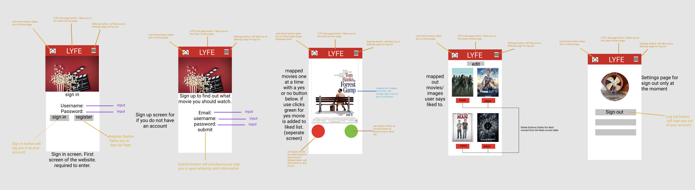
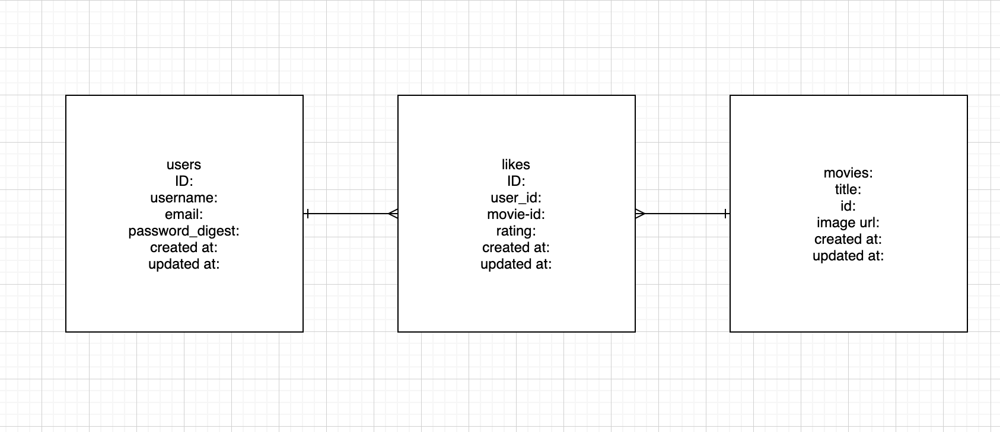
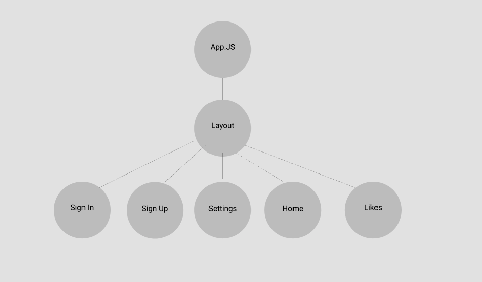
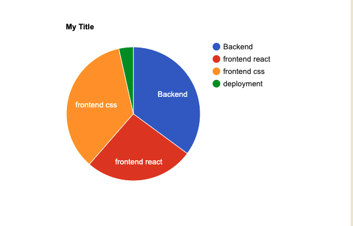

# LYFE - "changing ideas"

## Overview

LYFE is the App you can say yes or no to movies/photos/recipes/whatever you want. If you like them they are saved into your saved profile for you to look at any time. Down the road I will want to put an algorithim in that can make the experience even better for the user by collecting previous information from liked and disliked to calculate what the user would like to see.

## WireFrames

WireFrame

Tables

 Heirarchy 

## MVP

- Have a restful JSON API 

- build a Ruby on Rails server 
- Build a Database with 3 columns (Users, likes, dislikes)
- implement full CRUD on one table (Likes)

- Have a fully functioning React Front end
- Front end interacts with backend

- Styled with CSS
- media queries entered for 3+ screen sizes

## Most interested to learn on project

- personal goal for me is to have my 3 columns in backend working with my front end to store the data for future expansion of project. 

## Post MVP

- make more tables for different categories.
- make a link between two users to see what matches they share.
- implement a profile for users
- allow users to post in a different categroy
- create algorithim to calculate what people like
- sell to a company for 600 million

## Time

TimeFrame

